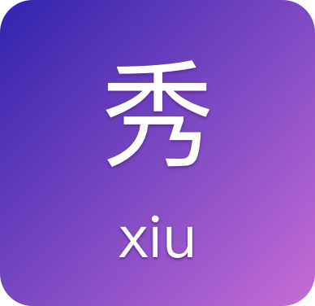

# 秀

<div align=center></div>

秀的拼音，在 toml 里面写配置，然后通过插件运行的工具，`shell`属性，对应`xiu-plugin-shell`插件。默认只带 `shell`插件。


## usage

1.安装命令行工具

```bash
npm i -g xiu-cli
```


2.创建配置文件 `xiu.toml`

```toml
[env]
NAME="Yugo"

[[pipes]]
name='test'
shell='''
echo $NAME
sleep 2
cal
echo "\a"
'''

[[pipes]]
name='build'
shell='''
echo 陈独秀同学，请你坐下
'''

[[pipes]]
name='deploy'
skip=true
shell='''
echo 买橘子
'''

```


3. 运行命令

设置了 skip 的，会跳过该调命令。

```
➜ xiu
```

## 如何开发插件

```js
function shell(task, shell){
    return shell(task.shell).then(() => false)
}

module.exports = module.exports.default = exports = shell

Object.defineProperty(exports, "__esModule", {
    value: true
});
```

以 shell 插件为例，`task` 是当前任务的所以配置，shell 是一个执行 shell 的执行器，放回一个 `false` 代表不跳过，放回 true 代表跳过本插件的运行。